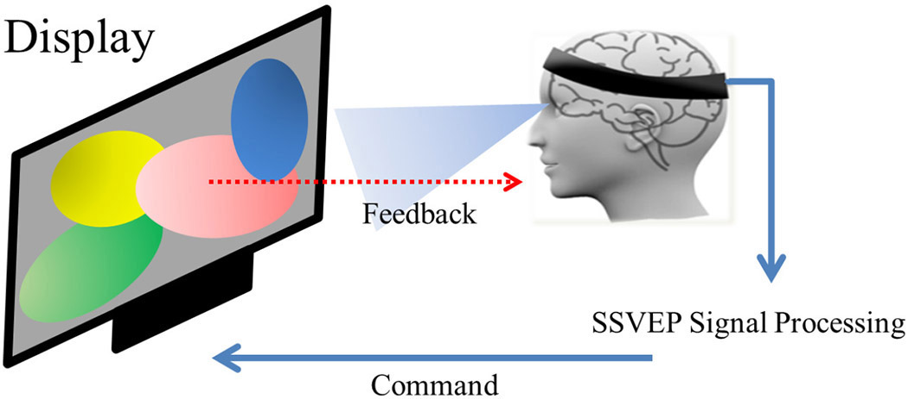

# Brain-Soother

## Idea

In neurology, Steady State Visually Evoked Potentials (SSVEP) are signals that are natural responses to visual stimulation at specific frequencies. When the retina is excited by a visual stimulus ranging from 3.5 Hz to 75 Hz, the brain generates electrical activity at the same (or multiples of) frequency of the visual stimulus.

see [Wikipedia](http://en.wikipedia.org/wiki/Steady_state_visually_evoked_potential)

We use the openBCI kit to stiumlate Visual and Auditory stimuli in order to calm the user down to a state of calmness.

see [openBCI](http://www.openbci.com/)

In order to achieve this we did a Fast Fourier Transform (FFT) to find the ideal frequency to induce calmness. As part of this project, we have proposed using flickering red lights to create an imperceptible flickering visual stimulus that can elicit an SSVEP at a inducive flickering frequency.

## Usage

* People with sleep deprivation
* People with stressful lifestyles
* People with ADHD

